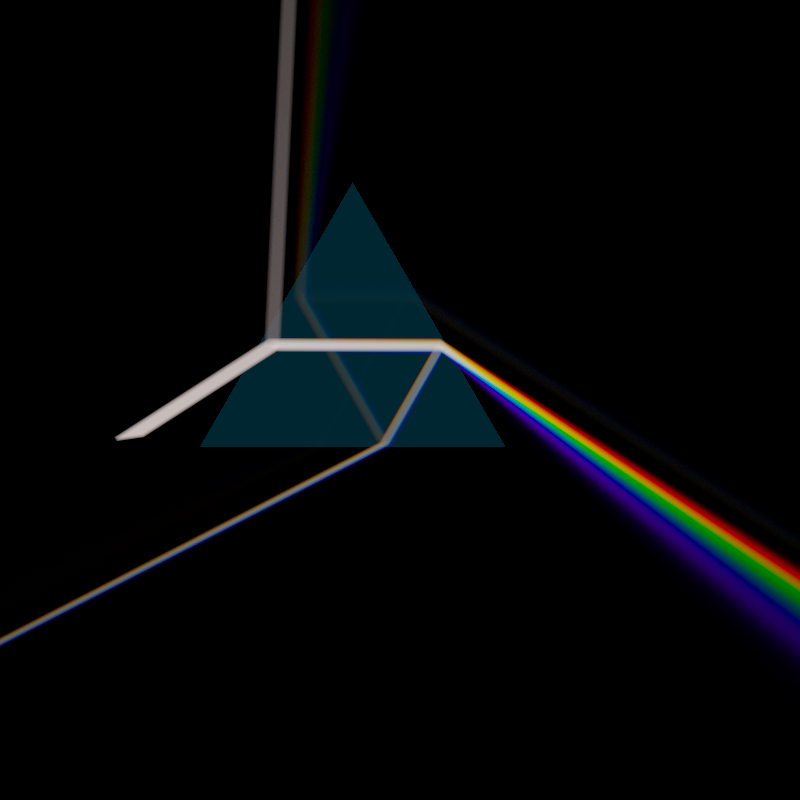
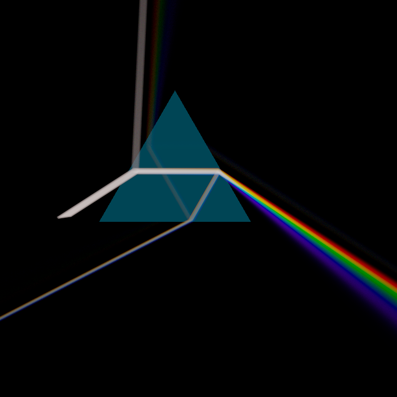
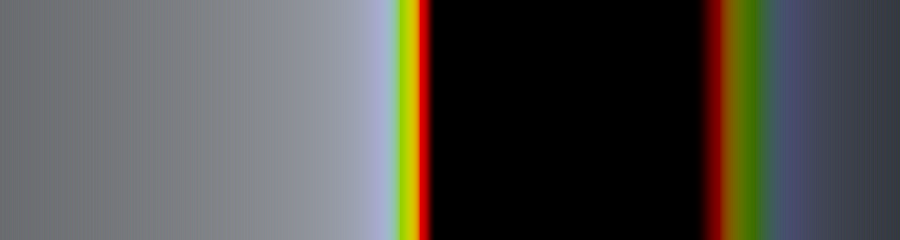
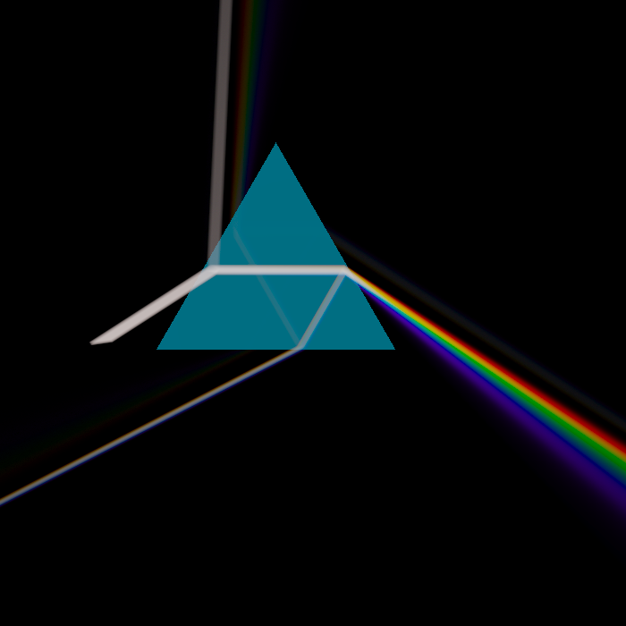
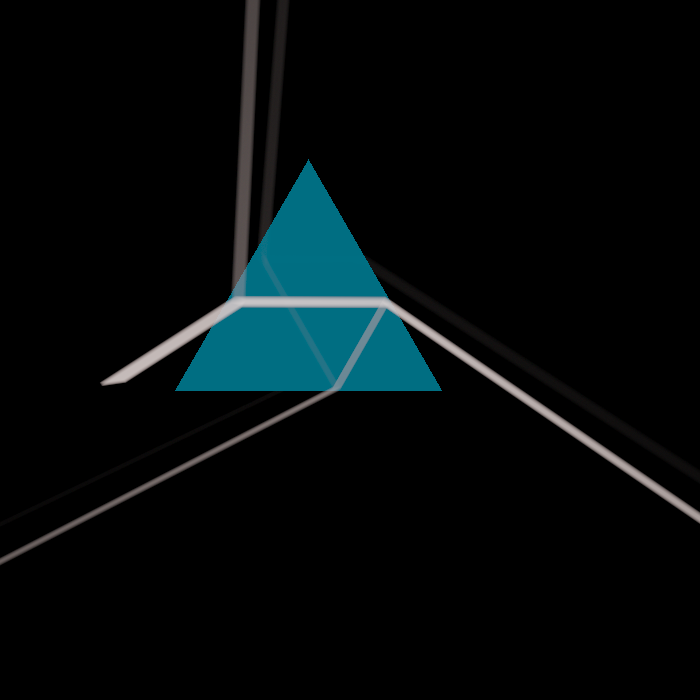
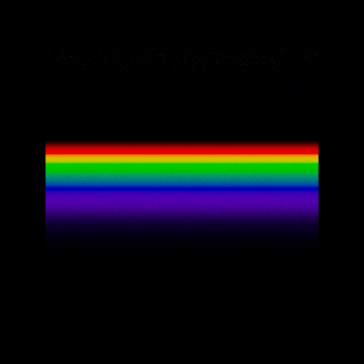
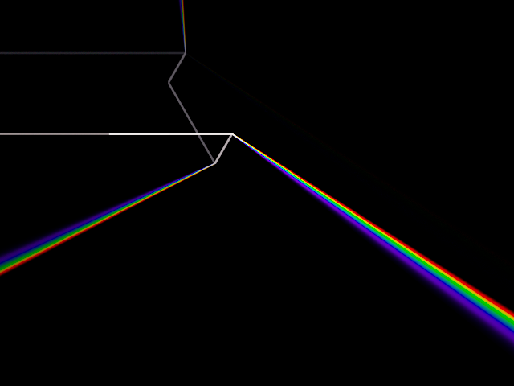

# spectral

A wavelength-resolved renderer. Light is carried as actual wavelengths instead of RGB triples, so it does the things RGB physically cannot: dispersion through a prism, the spectrum fanning out of glass, metamerism, and a forward-traced beam glowing in haze.



The headline scene is a Dark Side of the Moon homage: a collimated white beam enters an equilateral SF11 prism, refracts wavelength by wavelength, and a full spectrum fans out the far side, glowing in single-scatter haze on black. The same scene runs live on the GPU.

## Gallery

| | |
|---|---|
|  |  |
| GPU forward + volumetric composite | A water-droplet rainbow |
|  |  |
| Spectral transport: `n(λ)` disperses | Same scene, `n(550)` for all λ: the fan collapses to white |
|  |  |
| Dispersive caustic on a surface | Beam through haze |

(more in [`images/`](images/))

## What's here

Three crates:

- **`spectral-core`** — the CPU renderer. A spectral path tracer with hero-wavelength sampling, Sellmeier dispersion, a CIE 1931 sensor with swappable illuminants, and a forward light-tracer + single-scatter volumetric pass (`volume.rs`, `lighttrace.rs`). This is the reference: every result the GPU produces is checked against it.
- **`spectral-gpu`** — a `wgpu` compute-shader mirror of the CPU renderer. Each kernel is diff-gated against the CPU oracle, so "fast" never costs "correct."
- **`spectral-viewer`** — a live `winit`/`wgpu` window: orbit the prism, watch the spectrum sharpen, press SPACE to toggle dispersion on and off.

## How it works

- **Spectral transport.** A ray carries radiance at sampled wavelengths, not RGB. Refraction uses a wavelength-dependent index `n(λ)` (Sellmeier), so blue bends more than red and the beam fans into a spectrum. Hero-wavelength sampling keeps the wavelength count down without leaving chromatic noise.
- **Sensor.** Spectral radiance is integrated against the CIE 1931 colour-matching functions to XYZ, then to sRGB. Swapping the illuminant (D65, A) shifts colours exactly the way metamerism predicts.
- **The DSOTM beam.** The visible shaft and its fan are forward light tracing through a participating medium: photons scatter off haze and the single-scattered radiance is connected to the camera. That is why the beam glows in the air rather than only lighting surfaces.
- **Live reconstruction.** The viewer accumulates cheap point samples per frame and reconstructs smooth volumetric density with a screen-space neighbour kernel (a normalized Gaussian gather), so even a sparse frame reads smooth and the image converges in noise, not brightness.

## Correctness

The spine of the project: **every GPU kernel is diff-gated against the CPU oracle, and each gate is mutation-tested** (break a term, confirm the gate fails, revert). The RNG is bit-matched across CPU and GPU; per-photon paths agree to ~1e-6 including the total-internal-reflection boundary at the violet edge; the volumetric film matches the oracle to a fraction of a percent. The gates live in `spectral-gpu/tests/` and `spectral-core/tests/`.

```
cargo test
```

## Build and run

Render a still:

```
cargo run -p spectral-core --release --example prism_dsotm   # -> prism_dsotm.png
cargo run -p spectral-core --release --example rainbow
cargo run -p spectral-core --release --example prism_caustic
```

Run the live viewer:

```
cargo run -p spectral-viewer --release
```

Controls: drag or arrow keys to orbit, **SPACE** toggles dispersion (rainbow ↔ white), **ESC** to quit. It also has a headless capture mode: `--capture out.png --mode spectral|rgb --frames N`.

## Download

Prebuilt `spectral-viewer` binaries for macOS (arm64 and x86_64), Linux x86_64, and Windows x86_64 are attached to each [release](https://github.com/TSavo/spectral/releases). They are built natively per-OS in CI.

## Notes

- The live viewer's neighbour kernel is a screen-space reconstruction filter: correct at convergence, with a bounded blur on sparse frames. A view-independent 3D photon-density estimate is the path to full correctness and remains a future option.
- `wgpu` selects the platform backend automatically (Metal, Vulkan, or DX12).
